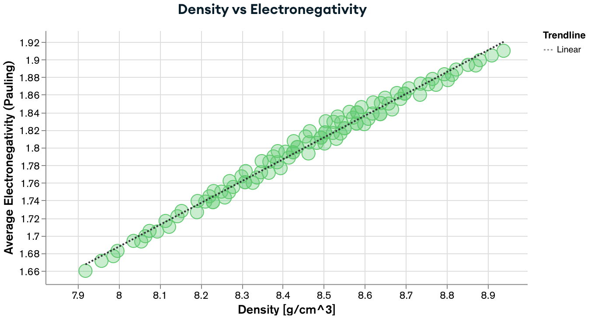

# MatSE580 Guest Lectures

## Contents
In these two lectures, I will give in **Fall 2023 MatSE 580 (Computational Thermodynamics)** at Penn State, which together should provide students with some basic knowlegde and skills in:
1. CALPHAD models for solution phases

2. Describe different models in thermodynamic database files

3. Use [pycalphad](https://pycalphad.org/docs/latest/) to plot phase diagram and predict desired properties from databases

  

 

4. Use [ESPEI](https://espei.org/en/latest/) to optmize parameter in solution phase and perform uncertainty quantification (UQ) and propagation (UP)

  

 

**The [`Lecture1.ipynb`](./Lecture1.html) Jupyter notebook covers points 1 and 2.**

**The [`Lecture2.ipynb`](./Lecture2.html) Jupyter notebook covers points 3 and 4.**

## How to start
Ideally, you should follow all instructions on your personal computer so that afterward, you have a neat setup ready to tackle future problems of your choosing or use it in your MatSE 580 final project. I strongly suggest using [VS Code](https://code.visualstudio.com) IDE for consistency in the class and with alternative setups (see below), but you are welcome to use anything of your choosing.

If, for any reason, using a personal computer is not possible, you can use [GitHub Codespaces](https://docs.github.com/codespaces), which are development containers running in your browser. On the free tier (120 CPU-h/month), you should be able to get 30h of work done on a moderately powerful (4 core / 16GB RAM) machine, which should be plenty for these lectures and the class project. To start a codespace, you simply go to the green `Code<>` button above and then follow `Codespaces` -> `***` -> `New with options...`, then make sure `main`, `US East`, and `4-core` are selected, and finally `Create a Codespace`. Wait a moment, and you should see a nice VS Code environment right in your browser!

## Persisting your work

Your local changes will be persisted in both local and Codespace environments.

It is good practice to also **Commit** your progress along the way. If you are using VS Code environment, either locally or through Codespaces, you can go it effortlessly by (1) going to `Source Control` (3rd icon in the left-side menu), (2) typing a short message, and (3) clicking `Commit`. If you have forked this repository, you can also `Push` to "upload" it to GitHub.
